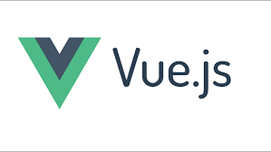

Creating a post on this blog is quite straightforward ! 

1. you first have to prepare your blog post in a [markdown](https://github.com/adam-p/markdown-here/wiki/Markdown-Cheatsheet) format 
2. you upload your content to your static webfolder (probably where you have published this website like on Amazon S3)
3. you update the file `bloglist.json` with all necessary information:

```
    {
    "date": "2020-07-20",
    "titre": "title of the blog",
    "link": "1/1st.md"
    },
```

## known limitations

* Link to picture doesn't work for relative path such as ``



you need to specify the full path to the ressource 

``


